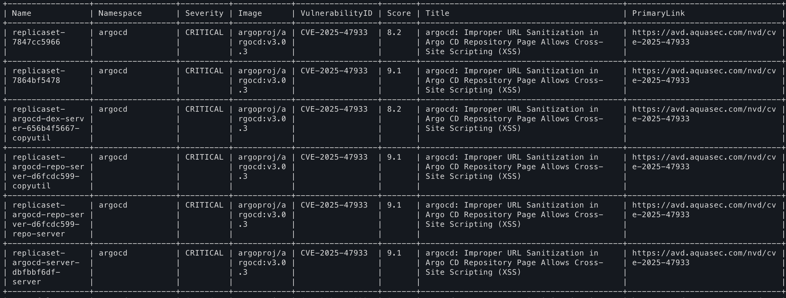
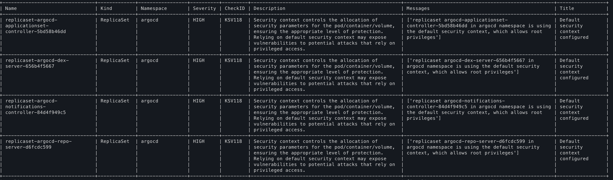

# Trivy Parser

## Requirements

- **Python**: 3.7 or higher
- **Libraries**: See `requirements.txt` for all dependencies
- **Kubernetes Cluster Access**: You must have access to a running Kubernetes cluster and a valid kubeconfig file (usually at `~/.kube/config`)
- **Trivy Operator**: The Trivy Operator should be installed in your Kubernetes cluster to generate reports

## Installation

It is recommended to use a Python virtual environment.

```bash
# Create and activate a virtual environment
python3 -m venv venv
source venv/bin/activate

# Install dependencies
pip install -r requirements.txt
```

## Example on how to retrieve a config audit report

```bash
python3 configauditreports.py
```

## Example on how to retrieve a config audit report vulnerability by severity type

```bash
python3 configauditreports.py --severity HIGH
```

## Example on how to retrieve a package/image vulnerability report

```bash
python3 vulnerabilityreports.py
```

## Example on how to retrieve a package/image vulnerability report by severity type

```bash
python3 vulnerabilityreports.py --severity CRITICAL
```

## Example output

A config audit report



A vulnerability report


